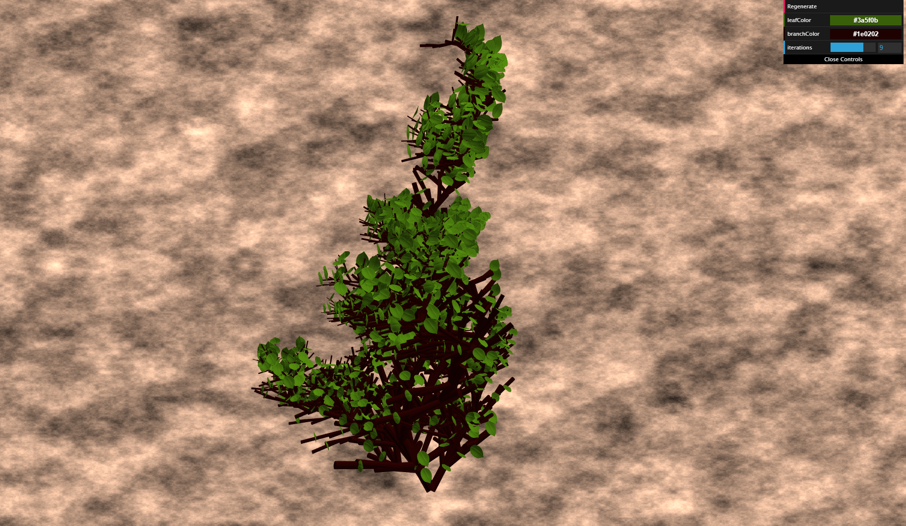

# L-Systems
_Created for CIS 566 Homework 4 in Spring 2019_

_Wei (Waley) Zhang (PennKey: wzha)_

[github.io Demo](https://greedyai.github.io/l-systems/)

## Features
- __Scene Elements.__ My scene consists of a single, dense fern. It was created using the following techniques:
  - L-System architecture: I created a collection of classes to represent an L-System. The Plant class is the "master" class that maintains the stack of Turtles, expands the grammar using a set of ExpansionRules, and creates the VBO instance arrays for both the fern's branches and leaves using a set of DrawingRules.
    - To make the fern look extra "ugly", I added a huge amount of randomness to my L-System. For example, every branch inherently rotates a random amount within a 15-degree (3D) cone of the previous branch, with the `+` and `-` operators doing something similar but with a much larger cone-of-rotation. The DrawingRule for "Z" also exhibits randomness: it draws a leaf half of the time, else it draws a branch.
    - The fern is shaded using a Lambertian shader.
  - Procedural background: The background is textured using Fractal Brownian Motion with a standard noise function with quintic falloff for interpolation. The result resembles that of soil.
  - User controls via dat.GUI.: The user can control three features in my scene: the branch color, the leaf color, and the number of iterations in the L-System. A "Generate" button has been provided to allow the user to manually regenerate the fern when desired--realtime updates of the scene are too inefficient.

## Screenshots
- __1 iteration__

- __5 iterations__

- __9 iterations__

## Citations
I did not use any external resources when implementing this assignment.
